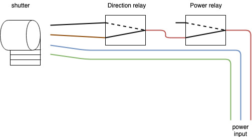

# django-rapspi-shutters
A django app to trigger wired shutters actuation

# installation
Add django_rest_framework and raspi_shutters to your installed apps
```python
INSTALLED_APPS=[
    # ...
    "rest_framework",
    "raspi_shutters",
    # ...
]
```

To wire up the thing, you'll need to connect GPIO outputs to a set of relays. You need to use 2 relays per shutter so that you have 1 relay to select shutter phase wire to power-up and another relay to connect phase to the second relay input.

For better explanation, see below diagram:



In case powerpinout is upside-down on all your relays, you can use the `GPIO_POWER_PINOUT_INVERTED` boolean setting to request inverted GPIO levels on power-relays.

In case direction pinout is upside-down, you can tick the 'upside-down' checkbox in your shutter configuration admin page.

# API Usage
Make sure api calls are authenticated, then you can:
- list shutters using GET /shutter/
- request shutter actuation using POST /shutter/<pk>/actuate/ {"target_position": "opened"/"middle"/"closed"}
- request all shutters actuation using POST /shutter/all/ {"target_position": "opened"/"middle"/"closed"}
- force stop in case of issue using POST /shutter/<pk>/force_stop/
